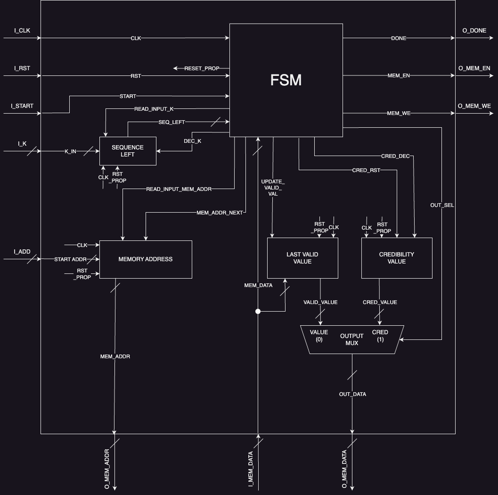
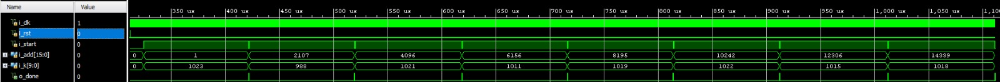
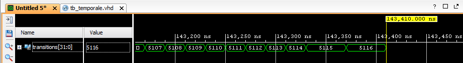

# Sequence Integrity Verifier



## 1. Introduction

The component to be implemented must interface with a memory and operate on a sequence of integer pairs as described below. For each pair, the second value is to be interpreted as an index of "credibility" or "reliability" of the first.

Having received as input the length of that sequence and the memory address from which to start (the sequence is stored on adjacent cells), the component must impose the credibility value at 31, for each "valid" (i.e., non-zero) value and replace the invalid ones with the last valid value encountered. The credibility value of the substitutes must decrease by one unit each time, never going below zero and returning to 31 only after encountering a "valid" value.

It is important to note that all invalid values placed at the beginning of the sequence cannot be replaced, they must therefore not be changed, and the corresponding credibility value must be set to zero.

Memory is byte-addressed. Each value (of credibility and noncredibility) is represented as an unsigned integer over 8 bits.

The following are examples of pre- and post-processing sequences by the component.

[**0**, 0, **0**, 0, **72**,  0, **198**,  0, **50**,  0, **65**,  0,  **0**,  0,  **0**,  0,  **0**,  0]  
[**0**, 0, **0**, 0, **72**, 31, **198**, 31, **50**, 31, **65**, 31, **65**, 30, **65**, 29, **65**, 28]

—

[**8**,  0, **0**,  0, **0**,  0, **0**,  0, **0**,  0, **0**,  0, **0**,  0, **0**,  0, **0**,  0]  
[**8**, 31, **8**, 30, **8**, 29, **8**, 28, **8**, 27, **8**, 26, **8**, 25, **8**, 24, **8**, 23]

As well as the python code that generates them, in accordance with the provided specification.

```python
from numpy import random

def generate_sequence():
    max_len = 1024
    max_val = 2**8

    # randomly generating parameters
    leading_zeros = random.randint(max_len)
    trailing_zeros = random.randint(max_len - leading_zeros)
    remaining_vals = random.randint(max_len - leading_zeros - trailing_zeros)

    # for good measure
    if leading_zeros + trailing_zeros + remaining_vals > max_len:
        print("SEQUENCE TOO LONG")
        return []

    sequence = []
    # fill in the sequence
    sequence += [0, 0]*leading_zeros
    for _ in range(remaining_vals):
        sequence.append(random.randint(max_val - 1))
        sequence.append(0)
    sequence += [0, 0]*trailing_zeros

    return sequence
```

```python
def component_simulator(sequence):
    i = 0
    last_valid_value = 0
    credibility = 0

    # skipping initial zeros and setting credibility to 0
    while i < len(sequence) and sequence[i] == 0:
        sequence[i+1] = 0
        i += 2

    while i < len(sequence):
        if sequence[i] != 0:
                         # valid value
            last_valid_value = sequence[i]  # update last valid value
            credibility = 31                # reset credibility value
        else:
                         # invalid value
            sequence[i] = last_valid_value  # replace invalid value

        sequence[i+1] = credibility         # set credibility
        if credibility > 0:
            credibility -= 1                # decrease credibility for next value
        
                 i += 2                              # go to next value

    # print(sequence)
    return sequence
```

## 2. Architecture

The component makes use of five main modules:

- **Sequence Left**
    
    stores the length of the sequence yet to be parsed.
    
- **Memory Address**
    
    keeps track of the memory address to be accessed
    
- **Last Valid Value**
    
    stores the last valid value encountered
    
- **Credibility Value**
    
    keeps track of the last credibility value set
    
- **FSM**
    
    manages the progress of the process and coordinates memory access operations
    

Below is a diagram representing these components and the signals that connect them.


Obviously, all the presented modules receive as input the clock signal(CLK), the same signal that comes from outside the component, and the reset signal(RST_PROP) that is propagated by the FSM when it receives the RST signal from outside.

The connections of these signals have been omitted so as not to burden the diagram, but they are easily deduced.

All signals are synchronous, the external ones are interpreted on the rising edge of the clock, the internal ones on the falling edge. This choice allows the machine to see the result of the commands imposed on the various components within the next rising edge, speeding up the whole process and avoiding the need to add simple wait states.

Reset signals, on the other hand, are asynchronous, bringing the machine to its initial state and the values stored by the various modules to zero.

A simple explanation of the individual modules and their operation follows.

---

### Sequence Left Module

This module features **two** memory elements.

The **first** stores the input value K_IN at each rising edge of the clock.

The **second** takes the value stored by the first on the falling edge of the clock only when the READ_INPUT_K signal, coming from the FSM, is high (i.e., when the value in the first is valid).

*This choice may seem an excessive complication since the component could simply store the input signal. However, because of what has already been said, it is necessary for the internal components to operate on the falling edge of the clock, at which time, according to the specification, the input values (I_K or I_ADD) may not make sense.*

The output signal SEQ_LEFT carries the stored information (corresponding to the length of the sequence yet to be analyzed) from the second memory **element** to the **FSM.**

The DEC_K input signal from the FSM brings the SEQ_LEFT value to decrement by one unit on the falling edge of the clock when placed at '1'.

---

### Memory Address Module

This module features two memory elements.

The first stores the START_ADDR input value at each rising edge of the clock.

The second takes the value stored by the first on the falling edge of the clock only when the READ_INPUT_MEM_ADDR signal, coming from the FSM, is high (i.e., when the value in the first is valid).

*The same considerations made for the previous one also apply to this module.*

The output signal MEM_ADDR is directly connected to the memory and corresponds to the stored address on which you want to operate.

The input signal MEM_ADDR_NEXT, coming from the FSM, causes the stored value to increase by one unit on the falling edge of the clock when placed at '1'.

---

### Last Valid Value Module

This module features two memory elements.

The first stores the input value MEM_DATA at each rising edge of the clock.

The second takes the value stored by the first on the falling edge of the clock only when the UPDATE_VALID_VAL signal, coming from the FSM, is high (i.e., when the value present in the first is valid).

*The same considerations made for the previous one also apply to this module.*

The output signal VALID_VALUE contains the stored information (corresponding to the last valid value encountered).

---

### Credibility Value module

This module stores the last set credibility value.

The input signal CRED_RST imposes, when placed at '1', the stored value at "31" on the falling edge of the clock.

The CRED_DEC input signal, when placed at '1', causes the stored value to decrease by one unit on the falling edge of the clock; it has no effect if the stored value is zero.

The output signal CRED_VALUE contains the stored information (corresponding to the last credibility value set).

---

### Output Mux Module

This module allows the FSM to select which of the values of VALID_VALUE and CRED_VALUE should go to the output(OUT_DATA) to be written to memory, via the choice signal OUT_SEL ('0' for VALID_VALUE, '1' for CRED_VALUE)

Of all, it is the only purely combinatorial module.

---

### FSM module

This module manages the operations to be performed on the internal components and memory by the various output signals.

It is a **Moore's FSM**, whose outputs depend only on the state it is in.

It is now important to dwell on the sequence of events that characterize the execution of a given instruction:

- the machine arrives in a new state at each rising edge of the clock
- as a consequence, the output signals of the FSM may vary (e.g., DEC_K = '1')
- shortly after the falling edge of the clock "instructions are executed" (e.g., SEQ_LEFT goes from '1' to '0')
- in this way, by the next rising edge, the machine has all the information it needs to make the correct transition (e.g., place itself in the SEQUENCE_COMPLETED state)

That being said, it is possible to list the various input signals, the different states of the machine and the corresponding output signals that are set to '1', the others being implicitly set to '0'.

Input signals:

- CLK
    
    clock signal, the machine performs a transition on its rising edge.
    
- RST
    
    reset signal, asynchronous, initializes the FSM.
    
- START
    
    start signal, comes from outside the component, allows the FSM to begin sequence processing.
    
- MEM_DATA
    
    signal carrying information from memory, on 8 bits, interpreted as an unsigned integer.
    
    It comes from the MEMORY ADDRESS module.
    
- SEQ_LEFT
    
    signal indicating the length of the sequence remaining to be analyzed, on 10 bits, interpreted as an unsigned integer.
    
    It comes from the SEQUENCE LEFT module.
    

Output signals:

- RESET_PROP
    
    propagates the reset signal to the rest of the modules, initializing them.
    
- DONE
    
    indicates to the outside of the component that processing is finished.
    
- MEM_EN
    
    directed to external memory, enables read/write operations.
    
- MEM_WE
    
    directed to external memory, indicates whether the operation to be performed is read (when low) or write (when high)
    

Output signals, to control the SEQUENCE LEFT module:

- READ_INPUT_K
- DEC_K

Output signals, for controlling the MEMORY ADDRESS module:

- READ_INPUT_MEM_ADDR
- MEM_ADDR_NEXT

Output signal, for controlling the LAST VALID VALUE module:

- UPDATE_VALID_VAL

Output signals, for checking the CREDIBILITY VALUE module:

- CRED_RST
- CRED_DEC

Output signal, for controlling the OUTPUT MUX module:

- OUT_SEL

Diagram of states:


The similarities between the diagram and the python code given at the beginning should be obvious.

The first while is implemented by the "leading zeros loop," the second by the two "valid" and "invalid" "values loops" that correspond to the two branches of the if-else. 

Note how the transitions represented by a discontinuous line (for simple reasons of graph readability) are transitions in their own right and, the way the FSM is implemented, take precedence over the others. That is, when the sequence to be analyzed is finished, and the machine is in one of states "1," "4," and "11," the next state will be "12."

A description of the states, and corresponding high output values, follows.

- (0) Reset
    - RESET_PROP.
        
        In this state the machine is waiting for the START signal, it also propagates the reset signal to the rest of the modules.
        
    
- (1) Read Input Data
    - READ_INPUT_K
    - READ_INPUT_MEM_ADDR
    - MEM_EN
        
        The machine forces the dedicated modules to store the information provided in the input, namely the length and start address of the sequence.
        
        Note how the latter is immediately propagated to the memory, which, being read-enabled, will provide the first value.
        
    
- (2) and (8) Wait For Mem.
    
    No high signal, waiting for the memory to provide the requested data.
    
- (3) Read First Value
    - UPDATE_VALID_VAL
        
        In this state, the machine has the necessary information (given in memory input) to decide which way to go. The signal is raised to make sure that if the value is non-zero, it is stored by the appropriate module.
        
    
- (4) Set Credibility Zero
    - MEM_ADDR_NEXT
    - DEC_K
    - MEM_EN
    - MEM_WE
        
        An invalid value was read at the beginning of the sequence.
        
        The address is incremented and write-enabled memory to force the credibility value to zero.
        
        The output selection is indifferent; both signals are set to zero.
        
        The length of the sequence to be analyzed is decremented.
        
    
- (5) Ask Next Value 1
    - MEM_ADDR_NEXT
    - MEM_EN
        
        The address to read from is incremented and the memory is enabled to read.
        
    
- (6) Set Credibility 31
    - CRED_RST
    - OUT_SEL
    - MEM_ADDR_NEXT
    - DEC_K
    - MEM_EN
    - MEM_WE
        
        A valid value has been read.
        
        Memory is enabled to write to the next address.
        
        The stored credibility value is reset to "31".
        
        The value selected to be written is the credibility value.
        
        The length of the sequence to be analyzed is decremented.
        
    
- (7) Ask Next Value 2
    - CCRED_DEC
    - MEM_ADDR_NEXT
    - MEM_EN
        
        The address to read from is incremented and the memory is enabled to read.
        
        The stored credibility value, to be set for the next valid value, is decremented.
        
- (9) Evaluate Memory Input
    - UPDATE_VALID_VAL
        
        The last valid value is updated (if different from zero).
        
        The machine must decide which transition to follow, based on this value.
        
- (10) Replace Invalid Value
    - MEM_EN
    - MEM_WE
        
        An invalid value was read.
        
        Memory is enabled to write to replace the previous invalid value.
        
        Selecting the output set to '0' allows the last valid value encountered to be written to memory.
        
- (11) Set Credibility Value.
    - OUT_SEL
    - MEM_ADDR_NEXT
    - DEC_K
    - MEM_EN
    - MEM_WE
        
        Memory is enabled to be written to the next address.
        
        The value selected to be written is the credibility value.
        
        The length of the sequence to be analyzed is decremented.
        
- (12) Sequence Complete
    - DONE
        
        Sequence terminated, the FSM communicates this information externally and waits for the START signal to return to zero.
        

## 3. Experimental Results

### Synthesis

Component synthesis requires the use of 77 Flip Flops and does not generate any latch.

Here is the usage report (summary version) generated by Vivado:

```
+-------------------------+------+
|        Site Type        | Used |
+-------------------------+------+
| Slice Registers         |   77 |
|   Register as Flip Flop |   77 |
|   Register as Latch     |    0 |
+-------------------------+------+
```

### Simulations

The component was tested post-synthesis on some sequences that are limit cases with respect to the specification and on others randomly generated by the code above.

Below are the tested limit cases:

- Sequence of length 0
    
    This test provides an input value I_K of zero. It is used to ensure that the component has no problems handling sequences of this type, and that it does not erroneously change any values in memory.
    
    (Transition SEQ_LEFT == 0 from the "read input data" state.)
    
- Sequence composed of only invalid values
    
    This test verifies that the machine completes processing the sequence, returning to the reset state, despite not having encountered any valid values.
    
    (Transition SEQ_LEFT == 0 from the "set credibility zero" state)
    
- Sequence with many invalid values overhead
    
    This test verifies that the machine correctly handles the presence of many invalid values at the head of the sequence, and then correctly processes the rest.
    
- Sequence with many invalid values preceded by valid values
    
    This test verifies that the credibility value set for the long sequence of invalid values is zero (from the thirty-first onward) and does not go below zero (returning to 31).
    

- Maximum length sequence
    
    This test, performed on several maximum length sequences, verifies the correct functionality of the SEQ_LEFT component even if it is initialized to the maximum value.
    
- Sequence interrupted by reset signal
    
    This test verifies that the component, after being interrupted of the reset signal, is able to resume processing the next sequence.
    

A number of cases consisting of numerous sequences, some of them corresponding to the above-mentioned borderline cases, submitted in series to the component were also tested.

Some cases consisted of 32 sequences of length 1024. 32*1024*2 = 65536.In these cases the component correctly processed the entire memory made available to it.

Without the need to raise the reset signal between sequences, the component correctly processed them.



The code that generates such tests is available on my github profile: [https://github.com/leonardoevi](https://github.com/leonardoevi)

The time requirement was met.

```
Timing Report

Slack (MET) :             2.857ns  (required time - arrival time)
```

## 4. Conclusions

The component was designed with the intent of emphasizing its modularity by separating each module according to the functionality performed. An attempt was also made to make the architecture as simple and clear as possible from the state machine, avoiding the inclusion of an excessive number of wait states.

In doing so, it was necessary to slightly complicate the operation of the other modules, yet benefiting from less processing time.

In fact, to process a generic sequence, of nonzero length, the machine takes a number of transitions equal to:

3 (to reach the "read first value" state) +

4 * number_of_initial_zeros (nz, to accomplish the "leading zeros loop") +

4 * number_of_valid_values (nvv, to fulfill the "valid values loop") +

5 * number_of_non_valid_values (nvnv, to fulfill the "invalid values loop") -

1 (due to the fact that it takes one less transition to return to the reset state than to complete any of the three loops)

Simplifying:

2 + 4*(nzi + nvv) + 5*(nvnv) transitions for sequences of length > 0

3 transitions otherwise.

Considering the **worst case** in which:

The sequence has maximum length, 1023 values (and as many credibility values).

It consists of a single valid value placed at the beginning.

That is, you have nzi = 0, nvv = 1, nvnv = 1022

It will take the machine 5116 transitions to complete processing the sequence, corresponding to just over 0.1 milli seconds (since the clock period is 20 ns).



In the case where the sequence has nzi = 5, nvv = 8, nvnv = 3, the machine takes 69 transitions to return to the reset state.


The signal that stores the number of transitions was inserted only in debugging and has no functional utility.

All this comes at a high cost in terms of memory elements used. In fact, a few more transitions could have been sacrificed, at the price of one or two flip flops to store the larger number of FSM states, to reduce by half the flip flops used in the three modules SEQUENCE_LEFT, MEMORY_ADDRESS, and LAST_VALID_VALUE.

Since the specification imposed no limits on either the total computation time or the number of memory elements used, both choices were equally viable.